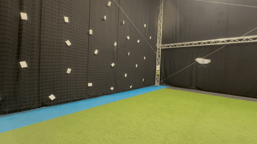
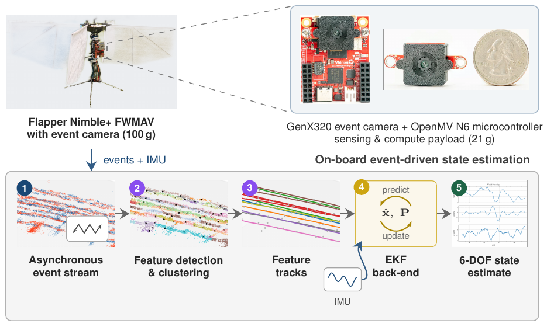
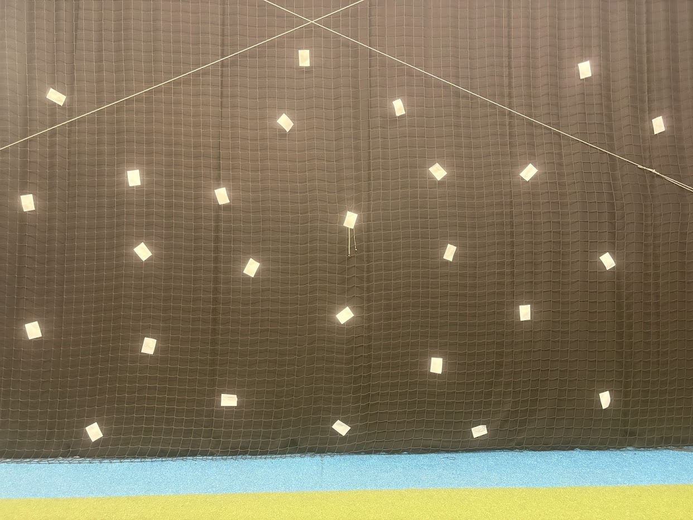
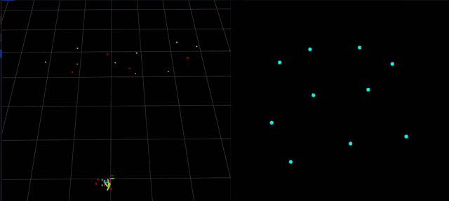
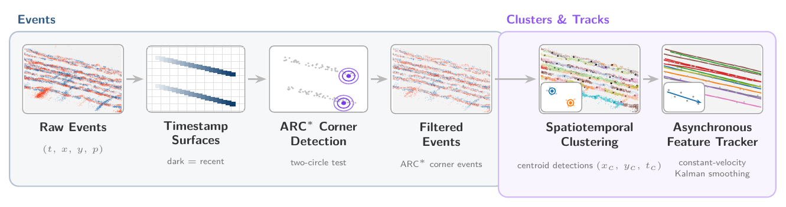
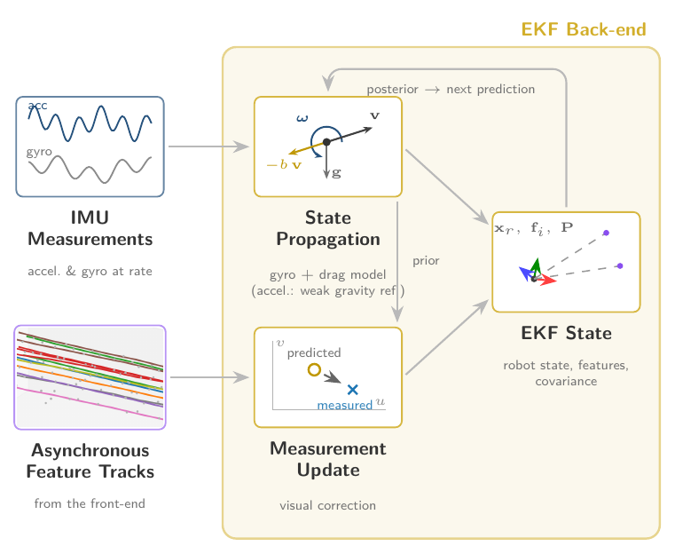

# Asynchronous Event-Based Visual-Inertial Odometry for Flapping-Wing MAVs
Code and materials accompanying my MSc thesis *"Asynchronous Event-Based Visual-Inertial Odometry for Flapping-Wing MAVs"*, Tijn Vennink, Delft University of Technology (TU Delft), 2026.

> **(Perhaps)The first full event-based visual-inertial odometry (EVIO) pipeline running entirely on-board a small, high-frequency flapping-wing MAV.** Within a ~21 g sensing-and-compute payload, the on-board estimate is accurate enough to close a position-control loop and hold a stationary hover.

<p align="center">
  <a href="media/60s_hover.mp4"></a>
  <br><em>On-board closed-loop hover — click for the full 60&nbsp;s video.</em>
</p>

---

## Abstract
Flapping-Wing Micro Air Vehicles (FWMAVs) operate under severe Size, Weight, and Power (SWaP) constraints, and their high-frequency flapping produces strong oscillatory dynamics that degrade conventional frame-based visual perception. Event cameras are well suited to these conditions, but event-based visual-inertial odometry (EVIO) methods typically rely on short-window, locally linear motion assumptions that flapping flight breaks: under flapping, event-alignment methods such as plane fitting and contrast maximization recover mostly the high-frequency flapping-induced body rotation rather than the platform's translation. This work presents the first full EVIO pipeline running entirely on-board a small, high-frequency flapping-wing platform.

The front-end deliberately avoids short-window alignment and instead exploits the abundance of flapping-induced events: it detects corner features event-by-event, clusters them into compact spatiotemporal features, and tracks these while discarding the fine oscillatory structure. The resulting asynchronous tracks are fused with inertial measurements in a tightly coupled Extended Kalman Filter. The complete pipeline runs in real time on an on-board microcontroller within a sensing-and-compute payload of roughly 21\,g. On flight datasets recorded on-board the FWMAV, the pipeline recovers velocity and attitude during flapping flight, and in a closed-loop flight test the on-board position estimate is accurate enough to hold a stationary hover in the horizontal plane. The same event stream that breaks conventional EVIO assumptions is thus sufficient not only for on-board state estimation, but for closing a position-control loop in flight.

---

## System overview

<p align="center">
  
</p>

The Flapper Nimble+ FWMAV carries a ~21 g sensing-and-compute payload (GenX320 event camera + OpenMV N6 microcontroller). The on-board pipeline turns the asynchronous event stream into a 6-DOF state estimate: **(1)** asynchronous event stream → **(2)** feature detection & clustering → **(3)** feature tracks → **(4)** EKF back-end fusing tracks + IMU → **(5)** 6-DOF state estimate.

---

## Media

**On-board 60-second hover (closed-loop flight test)** — click the image to play

[](media/60s_hover.mp4)

_Full video: [`media/60s_hover.mp4`](media/60s_hover.mp4) — opens the on-board 60&nbsp;s hover in GitHub's video player._

**Corner features tracked by the front-end** — paper markers on the arena wall provide the corners the pipeline detects and tracks



**Estimated vs. ground-truth trajectory** — left: on-board estimate (yellow) vs. ground-truth (purple) in 3D; right: features tracked in the event-camera frame



_Source clip: [`media/flight_gt_estimate_rerun_tracked_features_image_frame.webm`](media/flight_gt_estimate_rerun_tracked_features_image_frame.webm)._

**Sample flight data**
<!--  -->
_Figure coming soon (`media/flight_data.png`)._

---

## Pipeline in (very)short 

```
event stream  ──▶  event-by-event corner detection
              ──▶  clustering into compact spatiotemporal features
              ──▶  asynchronous feature tracking (fine oscillation discarded)
              ──▶  tightly-coupled EKF fusion with IMU  ──▶  on-board state estimate
```

**Front-end** — raw events → timestamp surfaces → ARC\* corner detection → filtered events → spatiotemporal clustering → asynchronous feature tracker

<p align="center">
  
</p>

**EKF back-end** — the asynchronous feature tracks and IMU are fused in a tightly-coupled EKF (state propagation + measurement update) that jointly estimates the robot state and feature positions

<p align="center">
  
</p>

## Platform
- Flapping-wing MAV with an on-board event camera + IMU.
- Sensing-and-compute payload of roughly **21 g**.
- Full EVIO pipeline runs in **real time on an on-board microcontroller** (no off-board compute). OpenMV N6.

---

## Repository structure
This repository will consolidate the thesis code:

| Subfolder | Component | Status |
|---|---|---|
| `offline/` | OpenMV offline replay & parameter-sweep tooling | _added in a later release_ |
| `openmv/` | On-board OpenMV camera firmware (event front-end + EKF) | _added in a later release_ |
| `firmware/` | Flapper flight firmware + UART interface | _added in a later release_ |
| `host/` | Host-side commander / logger | _added in a later release_ |
| `tinycmax/` | Adapted TinyCMax (event optical-flow reference) | _added in a later release_ |
| `analysis/` | Data analysis & figure generation | _added in a later release_ |
| `media/` | Hover video, trajectory animation, sample flight data | cool |

---

## Msc Thesis Paper
- **Title:** Asynchronous Event-Based Visual-Inertial Odometry for Flapping-Wing MAVs
- **Keywords:** Visual-Inertial Odometry · Event-Based Cameras · Flapping-Wing Micro Air Vehicles · State Estimation · Extended Kalman Filter
- **Link:** TU Delft repo link incoming.

## Author & supervisors
**Author:** Tijn Vennink — Department of Mechanical Engineering, TU Delft — t.vennink@student.tudelft.nl
**Supervisors:** Prof. Guido de Croon · Dr. Christophe de Wagter · Dr. Stein Stroobants · Dr. Jens Kober

---

